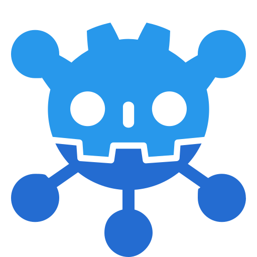
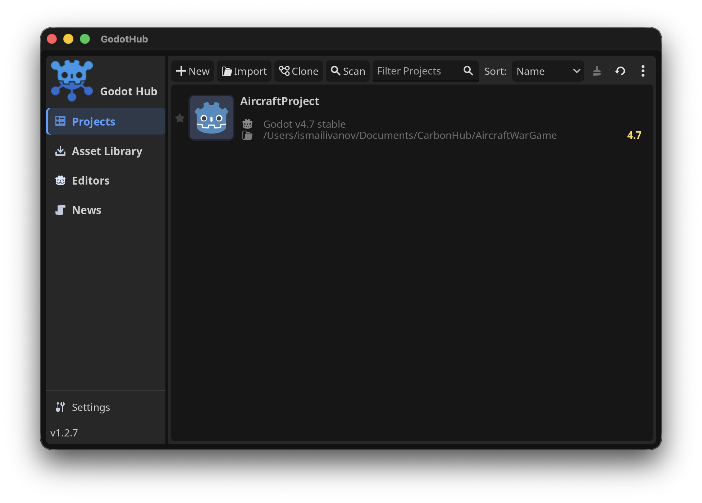
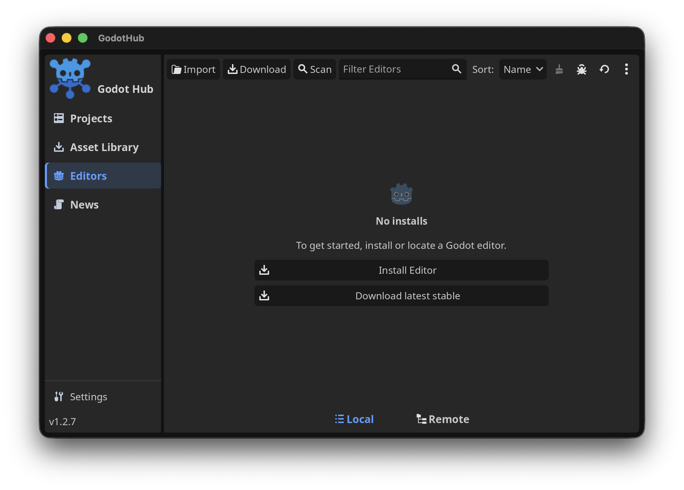
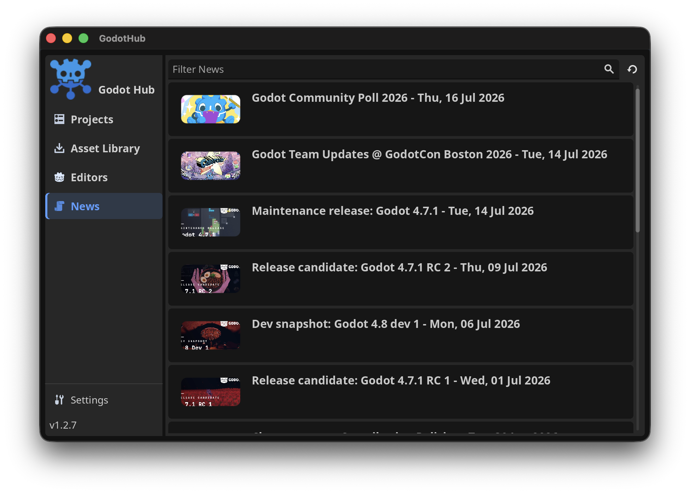

<p align="center">
  
</p>

<h1 align="center">Godot Hub</h1>

<p align="center">
  Your Godot editors, projects, and community news — together in one place.
</p>

<p align="center">
  <a href="https://github.com/ismailivanov/godot-hub/releases/latest"></a>
  
  <a href="LICENSE"></a>
</p>

<p align="center">
  <a href="https://github.com/ismailivanov/godot-hub/releases/latest"><strong>Download Godot Hub</strong></a>
  &nbsp;&nbsp;
  <a href="https://buymeacoffee.com/carbon06"></a>
</p>



Godot Hub takes care of the repetitive parts of working with Godot. Keep multiple editor versions installed, match projects with the right editor, and catch up on Godot news without jumping between folders and browser tabs.

## What you can do

- Install stable, preview, and custom Godot editor builds side by side.
- Import, organize, search, and launch all your projects from one library.
- Keep each project connected to the Godot version it needs.
- Browse the Asset Library and follow official Godot news.
- Update Godot Hub directly from the app on Windows, macOS, and AppImage installs.
- Use the desktop app or control it from the command line.

## Get started

Download the latest version from the [Releases page](https://github.com/ismailivanov/godot-hub/releases/latest), then follow the short guide for your platform.

### Windows

Download `GodotHub-Windows.zip`, extract it, and open `GodotHub.exe`.

### macOS

Download `GodotHub-macOS.zip`, extract it, and move **GodotHub.app** into your **Applications** folder.

Godot Hub is not code-signed yet. If macOS blocks it, run this once in Terminal:

```sh
sudo xattr -r -d com.apple.quarantine "/Applications/GodotHub.app"
```

### Linux

For a portable install, download `GodotHub-x86_64.AppImage`, make it executable, and open it:

```sh
chmod +x GodotHub-x86_64.AppImage
./GodotHub-x86_64.AppImage
```

Arch Linux users can install the [AUR package](https://aur.archlinux.org/packages/godot-hub-bin):

```sh
paru -S godot-hub-bin
```

Prefer a regular executable? Download `GodotHub-Linux.zip`, extract it, and run `GodotHub.x86_64`.

## Made for everyday Godot work

### Keep your editors under control

Download the latest stable Godot release in one click, keep older or preview versions nearby, and import custom editor builds whenever you need them.



### Find every project quickly

Create, clone, import, scan, search, and sort projects from one screen. You can also drop a `project.godot` file or project folder onto Godot Hub to import it.

### Stay close to the community

Read official Godot news with thumbnails, search by title, and see when something new has been published.



## Updates that fit your install

- **Windows and macOS:** Godot Hub downloads the new version, replaces the old one, and reopens automatically.
- **AppImage:** the current AppImage is replaced in place, then the new version starts.
- **Arch Linux:** update notifications hand the upgrade back to your AUR helper.

## Command line

Godot Hub also includes commands for opening projects and managing editors from a terminal. See the [CLI guide](.github/assets/FEATURES.md#cli) for the full list.

## About this project

Godot Hub is built on [MakovWait/godots](https://github.com/MakovWait/godots), originally created by Maxim Kovkel, and is maintained by [ismailivanov](https://github.com/ismailivanov).

Found a bug or have an idea? [Open an issue](https://github.com/ismailivanov/godot-hub/issues) — clear reports and small improvements are always welcome.

## License

Godot Hub is available under the [MIT License](LICENSE).
